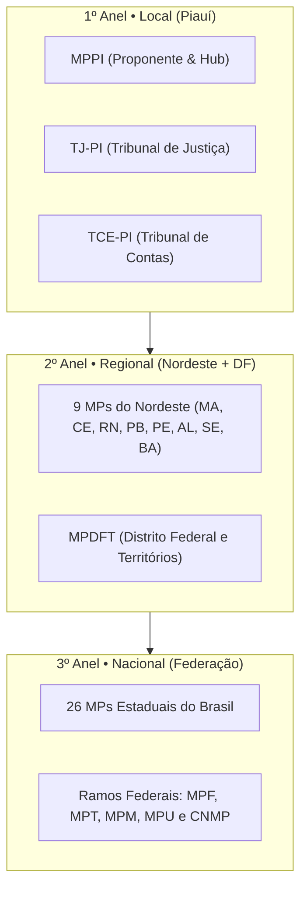

# 🏛️ PROJETO Lic.IA • Observatório de Governança & Compras Públicas
### Inteligência Artificial e Governança de Contratações Públicas no Ministério Público do Estado do Piauí (MPPI)

[](https://github.com/Thiago-Nog84/mapeamento-contratacoes-tce-pi)
[](https://www.mppi.mp.br)
[](http://localhost:5173)
[](https://www.tcepi.tc.br)

---

## 🎯 Visão Executiva

O **PROJETO Lic.IA** (Licitações + Inteligência Artificial, pronunciado *"Lícia"*) é uma solução institucional desenvolvida na Coordenadoria de Licitações e Contratos (**CLC**) do **Ministério Público do Estado do Piauí (MPPI)**. 

Inspirada na tríade de inteligência artificial do sistema de justiça piauiense — onde o **TJ-PI** possui a **JÚLIA** (processos judiciais) e a **SOFIA** (orçamento/finanças), e o **MPPI** dispõe da **OMNIS** (atividade finalística) — a **Lic.IA** nasce como a inteligência dedicada à **atividade-meio**, atuando na governança, conformidade regulatória, economicidade e auditoria de compras públicas.

O projeto é candidato ao **Prêmio CNMP 2026** na categoria *Governança e Gestão*, estruturado rigorosamente sob o **Ato PGJ nº 1.025/2020** (Metodologia APG/MPPI).

---

## 🌐 Arquitetura Estratégica: Os 3 Anéis Concéntricos

A governança do projeto opera em um modelo federado e concêntrico de colaboração interinstitucional:



1. **1º Anel • Local (Piauí)**:  
   * **Instituições**: MPPI (hub central), TJ-PI e TCE-PI.  
   * **Foco**: Conciliação tripartite de compras públicas, parametrização de minutas padronizadas e jurisprudência preventiva do Tribunal de Contas.
2. **2º Anel • Regional (Nordeste + MPDFT)**:  
   * **Instituições**: 9 Ministérios Públicos da Região Nordeste + MPDFT.  
   * **Foco**: Economia de escala, benchmarking de preços públicos regionais e compras conjuntas via carona/adesão a Atas de Registro de Preços.
3. **3º Anel • Nacional (Federação Completa)**:  
   * **Instituições**: Todos os 26 MPs Estaduais e os 4 Ramos do MPU (MPF, MPT, MPM, MPDFT) sob a coordenação estratégica do **CNMP** e **CNPG**.  
   * **Foco**: Padronização federativa por famílias de contratação (Segurança Institucional, Nuvem/TI Governamental, Sustentabilidade e Serviços Terceirizados).

---

## 📊 Base de Dados Consolidada (10.504 Atos de Contratação)

A plataforma já ingeriu e normalizou **10.504 atos contratuais e licitatórios** das 12 instituições prioritárias:

| Esfera | Órgãos Ingeridos | Atos Catalogados |
| :--- | :--- | :---: |
| **Piauí (1º Anel)** | MPPI (PGJ, FMMPPI, FEPDC), TJ-PI (Tribunal, FERMOJUPI, Corregedoria) e TCE-PI (Pleno e FMTC) | **2.624** |
| **Regional (2º Anel)** | MPPE, MPCE, MPDFT, MPBA, MPMA, MPRN, MPPB, MPAL, MPSE | **7.880** |
| **TOTAL** | **12 Instituições de Justiça e Controle** | **10.504** |

---

## ⚖️ Módulo de Jurisprudência do TCE-PI

A **Lic.IA** conta com um crawler e analisador semântico de jurisprudência do Tribunal de Contas do Estado do Piauí:

* **118 Informativos Oficiais de Julgamento baixados em PDF** (Plenário Presencial/Virtual, 1ª Câmara e 2ª Câmara).
* **1.766 Julgados e Processos Estruturados** no banco relacional (`dados_jurisprudencia_tce.db`).
* **224 Julgados específicos de Licitações e Contratos Administrativos** indexados no motor RAG para prevenção de cláusulas restritivas e conformidade de minutas.

---

## 💻 Painel Interativo Web (Lic.IA Dashboard)

Aplicação web moderna desenvolvida em React + Vite, disponível em `http://localhost:5173`:
* **Visão Geral**: Métricas consolidadas dos 10.504 atos e índice de conformidade da Lei 14.133/2021.
* **Economicidade Regional**: Comparativo de deságio e preços praticados entre os Ministérios Públicos.
* **Jurisprudência & Conformidade**: Auditoria preventiva contra entendimentos do TCE-PI.
* **Governança & CNMP**: Acompanhamento do dossiê institucional para a premiação do Conselho Nacional do Ministério Público.

---

## 🚀 Execução do Projeto

### 1. Clonar o Repositório
```bash
git clone https://github.com/Thiago-Nog84/mapeamento-contratacoes-tce-pi.git
cd mapeamento-contratacoes-tce-pi
```

### 2. Executar o Dashboard Web
```bash
cd dashboard
npm install
npm run dev
# Acesse http://localhost:5173
```

### 3. Executar o Crawler de Jurisprudência do TCE-PI
```bash
python crawler_ingestor_informativos_tce.py
```

### 4. Executar os Mapeadores do PNCP e Muralic
```bash
python mapear_pncp_mppi.py
python orquestrador_mppi_tjpi.py
```

---

## 🏛️ Alinhamento Institucional
* **Manual de Identidade Visual do MPPI**: Respeito estrito à paleta cromática (`#a60225`), tipografia Calibri e modelos de apresentação executiva.
* **Normativos de Referência**: Lei Federal nº 14.133/2021, IN TCE-PI nº 02/2026, Portaria CNMP-SG nº 151/2023 e Resolução CNMP nº 283/2024.
* **Contato**: Coordenadoria de Licitações e Contratos — CLC / MPPI.
