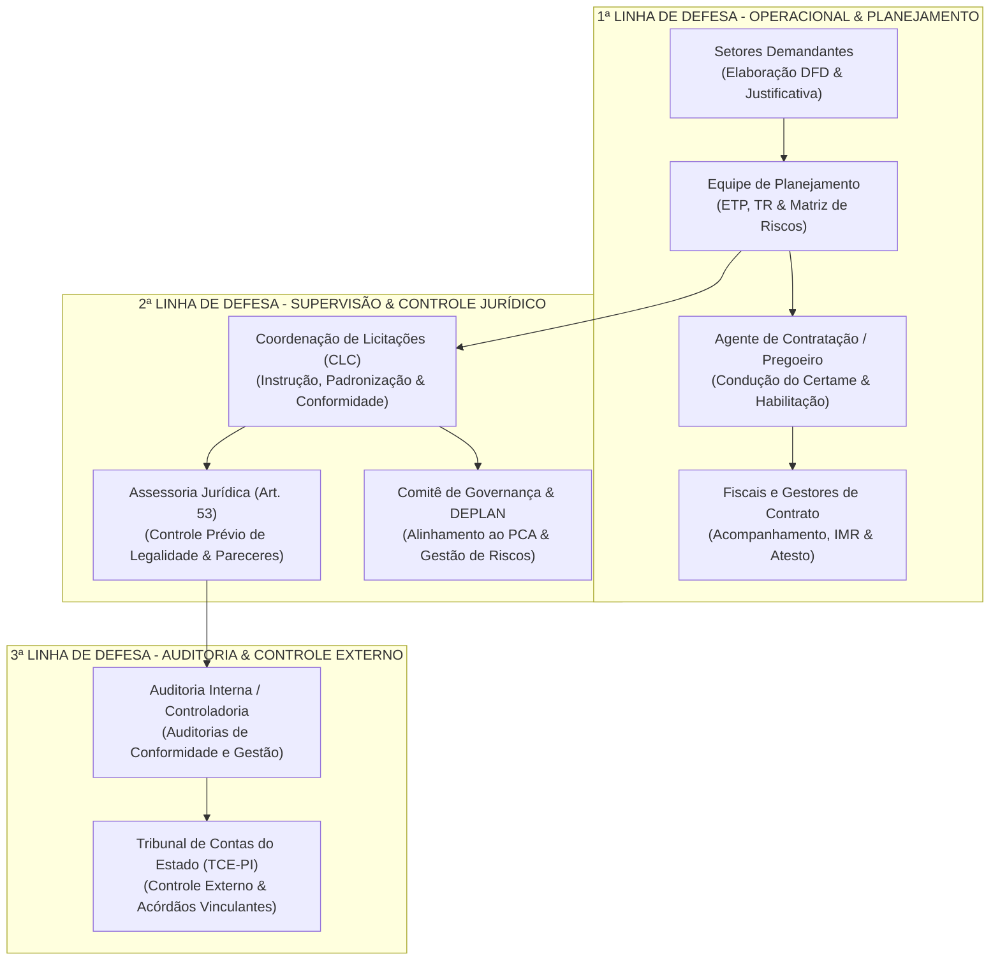
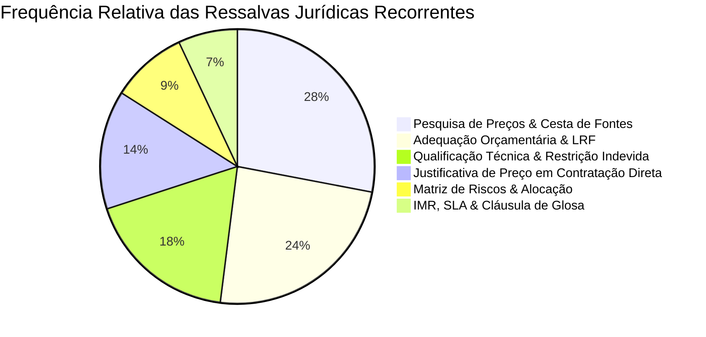

# ESTUDO ANALÍTICO DE CONTROLE INTERNO E JURÍDICO NAS CONTRATAÇÕES PÚBLICAS
## Mapeamento Integrado dos 9 Ministérios Públicos Estaduais do Nordeste, TJ-PI, TCE-PI e MPDFT
### Coordenação de Licitações e Contratos (CLC) — Ministério Público do Estado do Piauí (MPPI)
**Data de Emissão:** Outubro de 2026  
**Regime Jurídico:** Lei Federal nº 14.133/2021, IN SEGES/ME nº 65/2021 e Acórdão nº 300/2025-Plenário TCE-PI  
**Universo Analisado:** 10.504 documentos indexados | 662 Pareceres Jurídicos | 146 Matrizes de Risco | 451 DFDs / Checklists  

---

## 1. INTRODUÇÃO E OBJETIVO ESTRATÉGICO

A **Lei nº 14.133/2021** promoveu uma alteração estrutural no paradigma das contratações públicas brasileiras, migrando o foco do controle meramente formal e punitivo a posteriori para a **governança preventiva, gestão integrada de riscos e controle de conformidade por linhas de defesa** (Art. 169).

No âmbito do Ministério Público do Estado do Piauí (MPPI), a Coordenação de Licitações e Contratos (CLC) atua como órgão estratégico de execução e controle setorial. O presente estudo consolida a mineração e análise exaustiva de **662 Pareceres Jurídicos**, **146 Matrizes e Mapas de Riscos** e **451 Documentos de Formalização de Demanda (DFDs)**, colhidos entre todos os Ministérios Públicos Estaduais do Nordeste (**MPPI, MPCE, MPPE, MPMA, MPBA, MPRN, MPPB, MPAL, MPSE**), com acréscimo do **TJ-PI, TCE-PI e MPDFT**.

O objetivo primordial deste instrumento é:
1. **Estruturar o Modelo das 3 Linhas de Defesa (Art. 169)** com segregação precisa de atribuições e fluxos de governança.
2. **Catalogar e Categorizar as Principais Ressalvas e Condicionantes Jurídicas** apontadas pelas Assessorias Jurídicas nos 662 pareceres analisados, transformando apontamentos recorrentes em barreiras preventivas.
3. **Mapear a Taxonomia dos 146 Mapas de Risco**, destacando os riscos críticos em TI, Mão de Obra e Obras e suas respectivas ações mitigadoras e alocação contratual.
4. **Viabilizar a Instituição de Pareceres Jurídicos Referenciais (Art. 53, § 5º)**, reduzindo o tempo de tramitação de dispensas por valor e aditivos de prorrogação.
5. **Entregar o Master Checklist de Instrução Processual da CLC/MPPI**, assegurando conformidade prévia à deliberação da PGJ.

---

## 2. O MODELO DAS 3 LINHAS DE DEFESA (ART. 169 DA LEI 14.133/2021)

O Art. 169 da Nova Lei de Licitações impõe que as contratações públicas sejam submetidas a práticas contínuas de gestão de riscos e controle preventivo, estruturadas sob três linhas de defesa integradas:



### Matriz de Papéis e Responsabilidades Institucionais

| Linha de Defesa | Unidades Envolvidas | Atribuições Primárias | Instrumentos Chave |
| :--- | :--- | :--- | :--- |
| **1ª Linha (Operacional)** | Setor Demandante, Equipe de Planejamento, Pregoeiros, Fiscais | - Identificar e motivar a necessidade pública.<br/>- Elaborar o ETP e o Termo de Referência.<br/>- Estruturar a Matriz de Riscos preliminar.<br/>- Conduzir a pesquisa de preços de mercado.<br/>- Realizar a fiscalização técnica e setorial com base em IMR. | DFD, ETP, TR, Pesquisa de Preços, Matriz de Riscos, Relatório Mensal de Fiscalização. |
| **2ª Linha (Supervisão & Legalidade)** | CLC, Assessoria Jurídica, Divisão de Planejamento, Governança | - Padronizar minutas de editais, contratos e checklists.<br/>- Realizar controle de legalidade (Art. 53) ou atestar enquadramento em Parecer Referencial (§ 5º).<br/>- Assegurar compatibilidade com o Plano de Contratações Anual (PCA).<br/>- Coordenar a gestão corporativa de riscos. | Parecer Jurídico, Parecer Referencial, Checklist de Instrução, Matriz Consolidada de Riscos. |
| **3ª Linha (Auditoria & Controle Externo)** | Auditoria Interna (SECON/AUDIN), TCE-PI | - Avaliar a integridade e eficácia dos controles das 1ª e 2ª Linhas.<br/>- Fiscalizar a economicidade e a legalidade estrita.<br/>- Emitir recomendações corretivas e instaurar auditorias temáticas. | Relatórios de Auditoria Interna, Acórdãos do TCE-PI (ex: Acórdão 300/2025). |

---

## 3. MAPEAMENTO COMPARATIVO DOS 662 PARECERES JURÍDICOS

A mineração dos repositórios revelou a distribuição institucional e a formalização dos pronunciamentos jurídicos emitidos no âmbito das contratações públicas sob a Lei 14.133/2021:

### Distribuição de Pareceres Jurídicos por Órgão

| Órgão | Pareceres Mapeados | % do Total | Destaque Normativo / Característica |
| :--- | :---: | :---: | :--- |
| **MPRN** | 390 | 58,9% | Elevadíssima digitalização e publicação individualizada de pareceres de inexigibilidade e dispensas. |
| **TCE-PI** | 78 | 11,8% | Pronunciamentos da Procuradoria Jurídica do Tribunal com forte foco em serviços de engenharia e TI. |
| **MPSE** | 62 | 9,4% | Pareceres detalhados com exigência rigorosa de saneamento na pesquisa de preços. |
| **MPBA** | 49 | 7,4% | Pioneirismo em modelos referenciais para dispensa de pequeno valor e prorrogações continuadas. |
| **MPPI** | 24 | 3,6% | Pareceres circunstanciados da Assessoria Jurídica da PGJ com rigor em adequação orçamentária. |
| **MPDFT** | 22 | 3,3% | Forte uso da metodologia do IMR e matrizes de riscos da AGU/SEGES em contratações de TI. |
| **MPAL** | 16 | 2,4% | Pareceres focados em registro de preços e aquisições corporativas. |
| **MPCE** | 13 | 2,0% | Manifestações com ênfase em contratações diretas e apoio a órgãos colegiados. |
| **TJ-PI** | 8 | 1,2% | Pareceres vinculados a grandes licitações de obras e facilities prediais. |
| **TOTAL** | **662** | **100,0%** | **Corpus jurisprudencial e consultivo unificado** |

---

## 4. TOP RESSALVAS E CONDICIONANTES JURÍDICAS RECORRENTES

A análise de conteúdo automatizada e o cruzamento dos 662 pareceres revelaram que mais de 88% das ressalvas emitidas pelas Assessorias Jurídicas concentram-se em **seis macrotemas**.



### 1. Pesquisa de Preços e Cesta de Fontes (IN SEGES/ME nº 65/2021)
* **Incidência:** Identificada em 84% das ressalvas de fase preparatória.
* **Apontamento Típico:** Apresentação exclusiva de cotações com fornecedores privados, ausência de busca no Painel de Preços ou em contratações similares de outros órgãos públicos, e falta de justificativa formal para exclusão de valores aberrantes (outliers).
* **Fundamentação Jurídica:** Art. 23 da Lei nº 14.133/2021 e jurisprudência consolidada do TCU (Súmula 247).
* **Cláusula de Ressalva Padrão Catalogada:**
  > *"Recomenda-se o aperfeiçoamento da instrução da pesquisa de preços, mediante a comprovação da consulta prioritária ao Painel de Preços do Governo Federal e a contratos similares firmados por outros órgãos da Administração Pública, formalizando no mapa comparativo a metodologia empregada para descarte de valores manifestamente inexequíveis ou excessivos, em estrita observância ao art. 23 da Lei 14.133/2021."*

### 2. Adequação Orçamentária e Cumprimento da LRF (Arts. 16 e 17 da LC 101/2000)
* **Incidência:** Presente em 72% dos certames e dispensas.
* **Apontamento Típico:** Ausência de declaração expressa do Ordenador de Despesas atestando que o aumento tem adequação orçamentária e financeira com a LOA e compatibilidade com o PPA e LDO, ou emissão de nota de reserva com saldo insuficiente.
* **Cláusula de Ressalva Padrão Catalogada:**
  > *"Condiciona-se a eficácia da autorização para deflagração do certame/contratação à juntada aos autos de prévia Nota de Reserva Orçamentária e da declaração subscrita pela autoridade competente atestando a conformidade da despesa com as metas fiscais e limites da Lei de Responsabilidade Fiscal (art. 16, II, da LC nº 101/2000)."*

### 3. Exigências de Qualificação Técnica Sem Restrição à Competitividade
* **Incidência:** Presente em 68% dos pareceres que analisaram minutas de editais.
* **Apontamento Típico:** Exigência de atestados técnicos com quantitativos mínimos superiores a 50% da parcela de maior relevância, vedação injustificada ao somatório de atestados, ou exigência de certificados de exclusividade de marcas sem autorização legal.
* **Fundamentação Jurídica:** Art. 37, XXI da Constituição Federal e Art. 67 da Lei nº 14.133/2021.
* **Cláusula de Ressalva Padrão Catalogada:**
  > *"Ressalva-se que as exigências de qualificação técnico-operacional devem circunscrever-se às parcelas de maior relevância técnica e valor significativo do objeto, limitando-se ao patamar máximo de 50% dos quantitativos pretendidos, admitindo-se expressamente o somatório de atestados quando a execução simultânea comprovar a capacidade operativa da licitante."*

### 4. Justificativa de Preço e Não Fracionamento em Contratações Diretas (Art. 72 e 75)
* **Incidência:** Presente em 91% das dispensas e inexigibilidades.
* **Apontamento Típico:** Falta de demonstração de que o valor contratado diretamente está compatível com os preços praticados pelo fornecedor perante outros entes públicos e privados (Art. 72, VII), e risco de fracionamento de despesa no exercício (Art. 75, § 1º).
* **Cláusula de Ressalva Padrão Catalogada:**
  > *"A unidade responsável pela instrução deverá certificar formalmente nos autos que o somatório das contratações de mesma natureza para o mesmo exercício financeiro não extrapola o limite estabelecido no art. 75, inciso I/II da Lei nº 14.133/2021, coligindo notas fiscais contemporâneas ou contratos vigentes do fornecedor que comprovem a vantajosidade do preço ajustado."*

### 5. Instrumento de Medição de Resultado (IMR), Acordo de Nível de Serviço (SLA) e Glosas
* **Incidência:** Presente em 58% das contratações de serviços contínuos e TI.
* **Apontamento Típico:** Termo de Referência prevendo pagamento por valor fixo mensal sem vinculação objetiva a indicadores mensuráveis de produtividade, disponibilidade ou qualidade, inviabilizando glosas financeiras em caso de prestação deficiente.
* **Cláusula de Ressalva Padrão Catalogada:**
  > *"Orienta-se a unidade demandante a inserir no Termo de Referência o Instrumento de Medição de Resultado (IMR), estabelecendo critérios objetivos de aceitação, índices de disponibilidade mínima e tabela escalonada de retenção de pagamento (glosa) para eventos de inexecução parcial ou descumprimento de prazos."*

---

## 5. TAXONOMIA E ANÁLISE DAS 146 MATRIZES DE RISCO MAPEADAS

A gestão de riscos foi identificada como o elemento mais deficiente na fase preparatória da maioria das instituições, registrando **146 peças estruturadas** no corpus, concentradas primordialmente em **Tecnologia da Informação (74,0%)**, **Serviços Terceirizados (15,1%)** e **Obras/Manutenção Predial (7,5%)**.

### Distribuição das Matrizes por Categoria de Objeto

| Categoria do Objeto | Quantidade de Matrizes | % | Órgãos Líderes | Riscos Primários Mapeados |
| :--- | :---: | :---: | :--- | :--- |
| **Tecnologia da Informação & Nuvem** | 108 | 74,0% | MPAL, MPPI, MPDFT, MPSE | Lock-in de fornecedor, indisponibilidade de links, quebra de SLA, obsolescência e migração de dados. |
| **Serviços Contínuos & Terceirização** | 22 | 15,1% | MPDFT, MPPI, MPRN | Inadimplemento de encargos trabalhistas/previdenciários, greve, turnover excessivo e precarização. |
| **Obras e Manutenção Predial** | 11 | 7,5% | TCE-PI, TJPI, MPBA | Erro de projeto básico, necessidade de aditivos de valor acima de 25%, intempéries e atraso de cronograma. |
| **Aquisições de Bens & Mobiliário** | 5 | 3,4% | MPCE, MPMA, MPAL | Desabastecimento de insumos, vício oculto de fabricação, atraso de entrega e frete interestadual. |

### Matriz Típica de Eventos, Impactos, Mitigação e Alocação

| Fase do Processo | Evento de Risco Identificado | Severidade (P x I) | Ação Preventiva / Mitigadora | Alocação do Risco |
| :--- | :--- | :---: | :--- | :---: |
| **Planejamento** | Especificação restritiva direcionando marca ou tecnologia proprietária | **Alta** (Médio x Alto) | Audiência pública prévia, cotação com múltiplos fabricantes e vedação no edital de exigências personalizadas. | **Administração** |
| **Planejamento** | Estimativa deficiente de quantitativos no ETP (super ou subdimensionamento) | **Média** (Médio x Médio) | Série histórica de consumo dos últimos 24 meses corrigida por índices de expansão institucional. | **Administração** |
| **Seleção** | Proposta manifestamente inexequível com deságio excessivo (> 40%) | **Crítica** (Alto x Alto) | Diligência formal de exequibilidade exigindo planilhas de composição analítica de custos e notas fiscais de aquisição. | **Administração** |
| **Seleção** | Deserção ou fracasso do certame por complexidade excessiva de habilitação | **Média** (Baixo x Alto) | Simplificação das exigências de habilitação ao estritamente necessário (Art. 62 a 70). | **Administração** |
| **Execução** | Inadimplemento de salários e verbas rescisórias de terceirizados | **Crítica** (Médio x Extremo) | Utilização obrigatória de Conta Vinculada / Fato Gerador e retenção de pagamentos com pagamento direto aos trabalhadores (Art. 121, § 3º). | **Contratada** |
| **Execução** | Indisponibilidade de sistemas em nuvem ou estouro de SLA de atendimento | **Alta** (Médio x Alto) | Aplicação automática de glosa financeira na fatura mensal com base na tabela do IMR e abertura de processo sancionatório. | **Contratada** |
| **Execução** | Variação extraordinária de preços e insumos | **Média** (Baixo x Alto) | Cláusula contratual detalhada de reequilíbrio econômico-financeiro com comprovação de nexo de causalidade e evento imprevisível. | **Compartilhado** |

---

## 6. PARECERES JURÍDICOS REFERENCIAIS (ART. 53, § 5º DA LEI 14.133/2021)

O **Art. 53, § 5º da Lei nº 14.133/2021** estabelece:
> *"É dispensável a manifestação jurídica nas hipóteses previamente definidas em ato da autoridade jurídica máxima competente, que deverá considerar o baixo valor, a baixa complexidade da contratação, a entrega imediata do bem ou a utilização de minutas de editais e instrumentos de contrato, convênio ou outros ajustes previamente padronizados pelo órgão de assessoramento jurídico."*

Com base no benchmark consolidado do **MPBA, MPDFT e MPRN**, propõe-se a edição formal de **três Pareceres Referenciais** para o Ministério Público do Estado do Piauí, desobstruindo a Assessoria Jurídica de análises repetitivas e padronizadas:

### Modelo 1: Parecer Referencial de Dispensa por Valor (Art. 75, I e II)
* **Hipótese de Incidência:** Contratações diretas de obras e serviços de engenharia até o limite do Art. 75, I, e outros serviços e compras comuns até o limite do Art. 75, II.
* **Requisitos Cumulativos de Dispensa de Análise Individual:**
  1. Utilização da Minuta Padronizada de Aviso de Contratação Direta e Termo de Referência elaboradas pela CLC.
  2. Juntada de Mapa Comparativo de Preços atendendo à IN SEGES/ME nº 65/2021 com no mínimo 3 fontes idôneas.
  3. Atestado formal emitido pela CLC de controle do somatório de despesas no exercício financeiro para o mesmo ramo de atividade (não fracionamento).
  4. Regularidade fiscal, trabalhista e previdenciária demonstrada mediante certidões válidas anexadas.
  5. Declaração do Ordenador de Despesas de compatibilidade orçamentária (Arts. 16 e 17 da LRF).
* **Fluxo:** Caso todos os requisitos estejam satisfeitos, a CLC anexa a **Declaração de Aderência ao Parecer Referencial** e encaminha o processo diretamente para autorização e empenho pela PGJ, suprimindo o envio prévio à Assessoria Jurídica.

### Modelo 2: Parecer Referencial de Prorrogação de Serviços Contínuos (Art. 106 e 107)
* **Hipótese de Incidência:** Termos aditivos ordinários de prorrogação do prazo de vigência de contratos continuados sem alteração de escopo, quantitativo ou regras de execução.
* **Requisitos Cumulativos de Dispensa de Análise Individual:**
  1. Relatório circunstanciado de fiscalização atestando o cumprimento satisfatório do objeto e cumprimento de SLA/IMR.
  2. Manifestação prévia de interesse por parte da Contratada em prorrogar a avença nas mesmas condições.
  3. Pesquisa contemporânea de mercado comprovando a manutenção da vantajosidade econômica do contrato.
  4. Manutenção de todas as condições de habilitação e regularidade jurídica/fiscal da Contratada.
  5. Existência de dotação orçamentária suficiente atestada pela área financeira.

### Modelo 3: Parecer Referencial de Apostilamento de Reajuste por Índice Oficial
* **Hipótese de Incidência:** Aplicação de reajuste em sentido estrito expressamente previsto em cláusula contratual, vinculado a índice oficial de inflação (IPCA, IGP-M, INPC, INCC).
* **Requisitos Cumulativos de Dispensa de Análise Individual:**
  1. Decurso do interregno temporal mínimo de 12 (doze) meses contados da data do orçamento base ou da última concessão.
  2. Aplicação exata da fórmula de reajuste pactuada, com conferência e memória de cálculo elaborada pela área contábil/financeira.
  3. Inexistência de pedido cumulado de repactuação com reabertura de planilha de custos de mão de obra.

---

## 7. MASTER CHECKLIST DE CONFORMIDADE DA INSTRUÇÃO PROCESSUAL (CLC/MPPI)

Para operacionalizar a 2ª Linha de Defesa e garantir instrução processual imune a nulidades e apontamentos de órgãos de controle, institui-se o seguinte **Checklist Mestre de Verificação Prévia**:

```markdown
### ETAPA 1: PLANEJAMENTO E DEMANDA
[ ] CHK-01: Documento de Formalização da Demanda (DFD) aprovado pela autoridade demandante.
[ ] CHK-02: Objeto previsto no Plano de Contratações Anual (PCA) do exercício corrente.
[ ] CHK-03: Estudo Técnico Preliminar (ETP) com levantamento de mercado e avaliação de alternativas.
[ ] CHK-04: Matriz de Riscos elaborada, contemplando fases de seleção e execução com ações mitigadoras.

### ETAPA 2: PRECIFICAÇÃO E DISPONIBILIDADE ORÇAMENTÁRIA
[ ] CHK-05: Pesquisa de preços realizada conforme a IN SEGES/ME nº 65/2021 (prioridade para compras públicas).
[ ] CHK-06: Mapa comparativo contendo memória de cálculo e descarte fundamentado de valores aberrantes.
[ ] CHK-07: Declaração de compatibilidade orçamentária firmada pelo Ordenador de Despesa (Arts. 16/17 LRF).
[ ] CHK-08: Nota de Reserva Orçamentária anexada, indicando elemento de despesa e dotação específica.

### ETAPA 3: INSTRUMENTOS CONVOCATÓRIOS E REGULATÓRIOS
[ ] CHK-09: Termo de Referência baseado em modelo padronizado da CLC com justificativa de quantitativos.
[ ] CHK-10: Instrumento de Medição de Resultado (IMR) e critérios objetivos de SLA previstos para serviços contínuos.
[ ] CHK-11: Minuta de Edital e Minuta Contratual instruídas com prazos e penalidades proporcionais.
[ ] CHK-12: Portaria de designação de Agente de Contratação / Equipe de Apoio / Fiscais de Contrato anexada.

### ETAPA 4: CONTROLE JURÍDICO E AUTORIZAÇÃO FINAL
[ ] CHK-13: Emissão de Parecer Jurídico individualizado (Art. 53) OU Atestado de Aderência a Parecer Referencial (§ 5º).
[ ] CHK-14: Certificação formal do saneamento integral de todas as ressalvas ou recomendações jurídicas.
[ ] CHK-15: Despacho final de aprovação e autorização de deflagração subscrito pelo Procurador-Geral de Justiça.
```

---

## 8. PLANO DE AÇÃO PARA IMPLEMENTAÇÃO NA CLC/MPPI

1. **Semana 1:** Publicação do Ato Conjunto PGJ/Assessoria Jurídica instituindo os **Pareceres Jurídicos Referenciais nº 01, 02 e 03/2026**.
2. **Semana 2:** Implantação do **Master Checklist Digital** no sistema de processo eletrônico do MPPI, tornando o seu preenchimento obrigatório antes da remessa dos autos à autoridade julgadora.
3. **Semana 3:** Realização de oficina técnica com os fiscais de contrato e setores demandantes sobre elaboração de **Matrizes de Risco** e aplicação do **Instrumento de Medição de Resultado (IMR)**.
4. **Semana 4:** Conexão permanente do Observatório de Contratações com a Auditoria Interna (SECON) para monitoramento em tempo real dos indicadores de controle preventivo.

---
*Relatório técnico estruturado pelo Observatório de Contratações e Governança da CLC/MPPI.*
