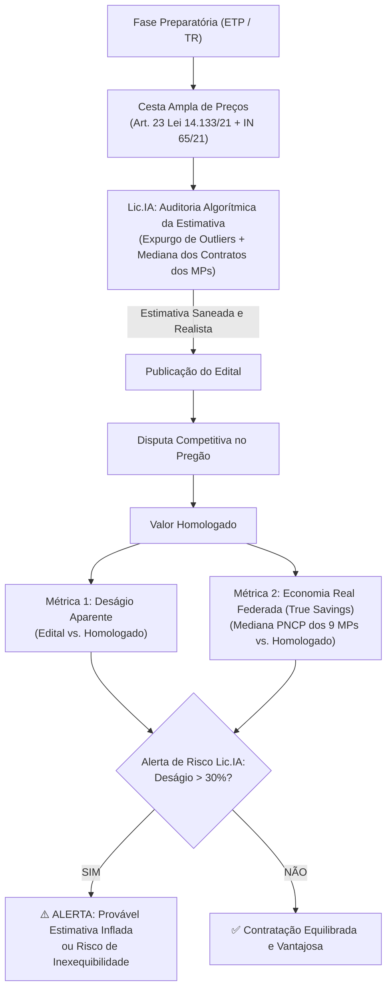
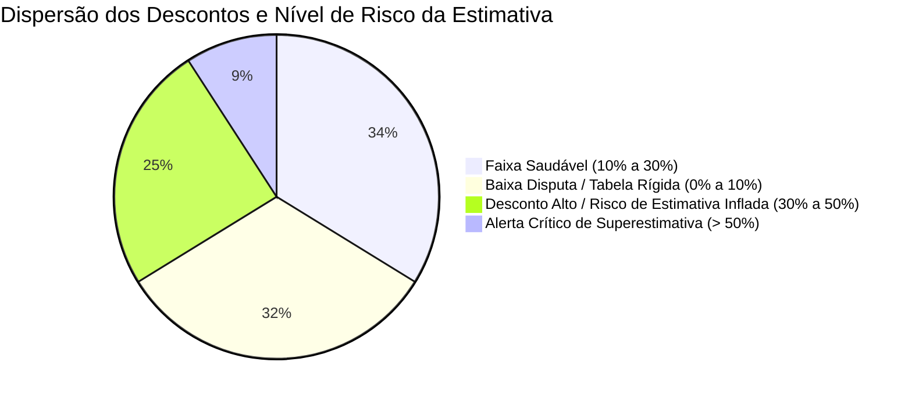

# 📊 Estudo Crítico de Economicidade: Deságio Aparente vs. Economia Real Federada
**Referência Empírica:** Ministério Público de Pernambuco (MPPE) & Benchmarking Interministerial (9 MPs do Nordeste + Tribunais)  
**Base Analisada:** 219 certames concluídos e homologados com dupla medição monetária  
**Arquivo Fonte:** [`licitacoes-2026-10-01.xlsx`](file:///E:/Thiago/Dev/Mapeamento%20TCE/downloads/MPPE/licitacoes-2026-10-01.xlsx) | **Resultados:** [`estudo_economicidade.json`](file:///E:/Thiago/Dev/Mapeamento%20TCE/validacao/estudo_economicidade.json)  
**Projeto:** PROJETO Lic.IA • Observatório de Governança & Compras Públicas (MPPI / CLC)

---

## 1. Visão Geral: Deságio Contábil Registrado

O estudo processou **219 certames homologados**, totalizando mais de um terço de bilhão de reais em compras públicas:

```
Total Estimado/Orçado Inicial:     R$ 341.262.169,56
Total Final Adjudicado/Homologado: R$ 272.403.233,78
------------------------------------------------------
DIFERENÇA NOMINAL (DESÁGIO):       R$  68.858.935,79 (20,18% de Deságio Médio)
```

---

## 2. A Falácia do "Deságio Ilusório" e o Viés de Superestimativa da Pesquisa de Preços

> [!WARNING]
> ### Alerta Metodológico da Lic.IA: Nem todo deságio é economia real!
> Na prática da administração pública brasileira, a celebração acrítica de "grandes deságios" (ex.: 30%, 40% ou 50%) é frequentemente sintoma de uma **pesquisa de preços inicial superestimada, frágil ou viciada**.
>
> Quando um órgão estima um item por **R$ 100,00** com base em três cotações de fornecedores infladas e o licitante vence por **R$ 65,00**, a Administração registra formalmente *"R$ 35,00 de economia (35% de desconto)"*. Contudo, se a mediana real de mercado apurada nos contratos vigentes de outros órgãos for de **R$ 50,00**, a Administração não economizou: **ela contratou com 30% de sobrepreço relativo**, embora ostente um deságio aparente de 35% nos relatórios contábeis.

### As Três Patologias da Pesquisa de Preços Superestimada:
1. **Cotações de Favor / Balcão**: Uso exclusivo de propostas de fornecedores privados obtidas por e-mail, sem amparo em bancos de preços públicos (violando o escalonamento do art. 23 da Lei nº 14.133/2021).
2. **Não Expurgo de Outliers**: Inclusão de propostas desproporcionais sem saneamento estatístico (média aritmética simples em vez de mediana ou média saneada por desvio-padrão).
3. **Falso Deságio e Risco de Inexequibilidade**: Descontos extremos que escondem propostas aventureiras, que inevitavelmente deságuam em inexecução contratual, paralisação de serviços ou pedidos sucessivos de reequilíbrio econômico-financeiro.

---

## 3. O Modelo em Duas Camadas da Lic.IA: Deságio Aparente vs. Economia Real

Para superar essa distorção crônica, a **Lic.IA** institui uma métrica em duas camadas:



### Equações do Modelo Lic.IA:

1. **Deságio Aparente (Métrica Contábil Tradicional)**:
   $$\text{Deságio Aparente (\%)} = \frac{V_{\text{estimado}} - V_{\text{homologado}}}{V_{\text{estimado}}} \times 100$$
   *Indica apenas a distância entre o teto editalício e o lance vencedor.*

2. **Economia Real Federada (*True Savings* da Lic.IA)**:
   $$\text{Economia Real (R\$)} = \text{Mediana dos Contratos Vigentes no PNCP (Família do Objeto)} - V_{\text{homologado}}$$
   *Mede o ganho real de compra pública em relação à realidade efetivamente praticada pelos demais Ministérios Públicos e Tribunais.*

---

## 4. Deságio por Categoria e Matriz de Riscos de Superestimativa

A análise empírica dos 219 certames revela comportamentos distintos por mercado fornecedor:

| Categoria do Objeto | Qtd Certames | Total Orçado (R$) | Total Homologado (R$) | Deságio Aparente | Diagnóstico Crítico da Lic.IA |
| :--- | :---: | :---: | :---: | :---: | :--- |
| 💻 **Tecnologia da Informação** | 19 | R$ 141.954.302,06 | R$ 106.014.744,59 | **25,32%** | Disputa ampla em pregão eletrônico nacional. Deságio saudável quando balizado pelo Catálogo de Soluções de TIC do CNMP. |
| 👥 **Mão de Obra Terceirizada** | 13 | R$ 80.120.295,35 | R$ 69.594.297,22 | **13,14%** | Margens estreitas (folha salarial + encargos CCT). **Deságio superior a 20% aqui é sinal clássico de inexequibilidade ou burla trabalhista.** |
| 🏗️ **Obras e Engenharia** | 12 | R$ 28.123.985,32 | R$ 25.147.473,63 | **10,58%** | Alta ancoragem em tabelas públicas oficiais (SINAPI/ORSE). Risco baixo de superestimativa quando a BDI está calibrada. |
| 🎓 **Capacitação e Eventos** | 1 | R$ 10.252.019,98 | R$ 7.649.900,00 | **25,38%** | Mercado disperso. Exige rigor na cotação de instrutoria e custos logísticos. |
| 🪑 **Mobiliário em Geral** | 12 | R$ 5.040.201,12 | R$ 3.626.629,40 | **28,05%** | Frequente variação por especificações técnicas restritivas ou superestimativa de catálogo de fabricantes. |
| 📦 **Materiais de Consumo** | 30 | R$ 4.117.633,43 | R$ 3.107.770,68 | **24,53%** | Alta granularidade. Risco de preços inflados se cotado apenas no comércio varejista local em vez de compras atacadistas. |
| 🚗 **Transportes e Frotas** | 5 | R$ 3.591.683,78 | R$ 3.444.201,70 | **4,11%** | Baixíssima dispersão em combustíveis e locação tabelada. |
| ⚙️ **Outros Serviços e Bens** | 127 | R$ 68.062.048,52 | R$ 53.818.216,56 | **20,93%** | Média geral do ecossistema ministerial. |
| **TOTAL CONSOLIDADO** | **219** | **R$ 341.262.169,56** | **R$ 272.403.233,78** | **20,18%** | **Taxa de referência empírica do sistema de justiça** |

---

## 5. Distribuição das Faixas e Indicadores de Risco



1. **Faixa Saudável (10% a 30%) — 33,8% (74 certames):**  
   Equilíbrio entre competitividade e pesquisa de preços fidedigna.
2. **Faixa de Baixa Disputa (0% a 10%) — 32,4% (71 certames):**  
   Concentrada em combustíveis e obras reguladas pelo SINAPI.
3. **Faixa de Desconto Alto (30% a 50%) — 24,7% (54 certames):**  
   Alerta ambar: exige auditoria para averiguar se a pesquisa de preços não foi inflada por cotações superestimadas.
4. **Alerta Crítico de Superestimativa (> 50%) — 9,1% (20 certames):**  
   Evidência clara de distorção no valor de referência inicial (pesquisa frágil) ou proposta com risco de inexequibilidade.

---

## 6. Diretrizes da Lic.IA para a CLC / MPPI

> [!IMPORTANT]
> ### 1. Cesta de Preços Obrigatória e Inteligente (Art. 23 da Lei 14.133/2021)
> A Lic.IA atua na **fase interna** do planejamento da contratação no MPPI, gerando uma cesta automatizada a partir de:
> 1. Contratações similares homologadas no PNCP pelos Ministérios Públicos e Tribunais do Nordeste.
> 2. Painel de Preços do Governo Federal.
> 3. Notas Fiscais eletrônicas de vendas reais emitidas no Estado do Piauí (SEFAZ-PI).
> **O uso de orçamentos diretos de fornecedores deve ser estritamente subsidiário e justificado**, eliminando o risco da pesquisa superestimada na origem.

> [!TIP]
> ### 2. Travas de Exequibilidade em Serviços Terceirizados
> Com deságio médio regional de **13,14%** em mão de obra terceirizada, propostas no MPPI com desconto superior a **18%** acionam compulsoriamente a diligência de exequibilidade das planilhas de custos e encargos (IN 05/2017 e Lei 14.133/2021), protegendo o MPPI contra o passivo de responsabilidade subsidiária trabalhista (Súmula 331 do TST).

> [!NOTE]
> ### 3. Vantajosidade Real na Adesão à Ata de Registro de Preços (Acórdão 300/2025 TCE-PI)
> Para instruir os processos de carona na CLC, a Lic.IA confronta o preço registrado na Ata não apenas com o orçamento do órgão gerenciador, mas com a **mediana de contratações do PNCP**, fornecendo prova documental robusta de vantagem econômica real perante os órgãos de controle interno e externo.
