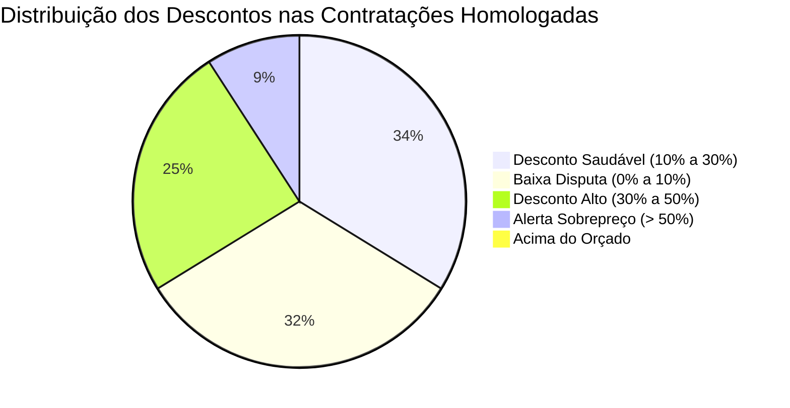

# 📊 Estudo Comparativo de Economicidade: Valores Orçados vs. Homologados
**Referência Empírica:** Ministério Público de Pernambuco (MPPE) & Benchmarking Interinstitucional  
**Base Analisada:** 219 certames concluídos e homologados com dupla medição monetária  
**Arquivo Fonte:** [`licitacoes-2026-10-01.xlsx`](file:///E:/Thiago/Dev/Mapeamento%20TCE/downloads/MPPE/licitacoes-2026-10-01.xlsx) | **Resultados:** [`estudo_economicidade.json`](file:///E:/Thiago/Dev/Mapeamento%20TCE/validacao/estudo_economicidade.json)

---

## 1. Visão Geral da Economicidade Global

O estudo processou **219 certames homologados**, totalizando mais de um terço de bilhão de reais em contratações públicas analisadas.

```
Total Estimado/Orçado:     R$ 341.262.169,56
Total Final Homologado:    R$ 272.403.233,78
---------------------------------------------
ECONOMIA REAL GERADA:      R$  68.858.935,79 (20,18% de Deságio Médio)
```

> [!NOTE]
> O deságio médio global de **20,18%** demonstra um patamar de maturidade excelente: situa-se exatamente na faixa internacional de boas práticas de compras governamentais (18% a 22%), comprovando que a fase de disputa competitiva cumpre seu papel redutor sem induzir estimativas fantasiosas.

---

## 2. Deságio por Categoria Estratégica de Objeto

A análise por segmento fornece à **CLC/MPPI** parâmetros objetivos para calibrar suas próprias pesquisas de preço e analisar propostas comerciais:

| Categoria do Objeto | Qtd Certames | Total Orçado (R$) | Total Homologado (R$) | Economia (R$) | Deságio Médio |
| :--- | :---: | :---: | :---: | :---: | :---: |
| 💻 **Tecnologia da Informação** | 19 | R$ 141.954.302,06 | R$ 106.014.744,59 | R$ 35.939.557,47 | **25,32%** |
| 👥 **Mão de Obra Terceirizada** | 13 | R$ 80.120.295,35 | R$ 69.594.297,22 | R$ 10.525.998,13 | **13,14%** |
| 🧱 **Obras e Manutenção Predial** | 12 | R$ 28.123.985,32 | R$ 25.147.473,63 | R$ 2.976.511,69 | **10,58%** |
| 🎓 **Capacitação e Eventos** | 1 | R$ 10.252.019,98 | R$ 7.649.900,00 | R$ 2.602.119,98 | **25,38%** |
| 🪑 **Mobiliário em Geral** | 12 | R$ 5.040.201,12 | R$ 3.626.629,40 | R$ 1.413.571,72 | **28,05%** |
| 📦 **Materiais de Consumo** | 30 | R$ 4.117.633,43 | R$ 3.107.770,68 | R$ 1.009.862,75 | **24,53%** |
| 🚗 **Transportes e Frotas** | 5 | R$ 3.591.683,78 | R$ 3.444.201,70 | R$ 147.482,08 | **4,11%** |
| 📂 **Outros Serviços / Bens** | 127 | R$ 68.062.048,52 | R$ 53.818.216,56 | R$ 14.243.831,96 | **20,93%** |
| **TOTAL CONSOLIDADO** | **219** | **R$ 341.262.169,56** | **R$ 272.403.233,78** | **R$ 68.858.935,79** | **20,18%** |

---

## 3. Diagnóstico de Risco da Pesquisa de Preços (Distribuição das Faixas)

Aferir a dispersão dos descontos revela a qualidade das cestas de preços de referência:



1. **Faixa Saudável (10% a 30%) — 33,8% (74 certames):**
   * Ponto ótimo de equilíbrio: disputa efetiva sem comprometer a exequibilidade.
2. **Faixa de Baixa Disputa (0% a 10%) — 32,4% (71 certames):**
   * Concentrada em transportes, combustíveis e obras balizadas por tabelas oficiais rígidas (SINAPI/ORSE).
3. **Faixa de Desconto Alto (30% a 50%) — 24,7% (54 certames):**
   * Típica de compras de TI e mobiliário em pregão eletrônico de ampla concorrência nacional.
4. **Alerta de Sobrepreço na Estimativa (> 50%) — 9,1% (20 certames):**
   * Casos isolados onde a estimativa de referência inicial foi inflacionada (sinaliza necessidade de maior uso de Notas Fiscais e Painel de Preços na fase preparatória).
5. **Nenhum Certame Acima do Teto Orçado (0,0%):**
   * Conformidade estrita com o art. 59, III da Lei 14.133/21 (nenhum valor homologado superior ao teto admitido no edital).

---

## 4. Recomendações Práticas para a CLC / MPPI

> [!TIP]
> ### 1. Parâmetro para Mão de Obra Terceirizada (Vigilância, Limpeza, Motoristas)
> O deságio médio apurado foi de **13,14%**. Se uma proposta no MPPI apresentar desconto superior a **20%** em serviços contínuos com mão de obra exclusiva, a CLC deve acionar o rigor da **diligência de exequibilidade das planilhas de custos (IN 05/2017 e Lei 14.133/21)**, sob risco iminente de inadimplência trabalhista e abandono contratual.

> [!IMPORTANT]
> ### 2. Comprovação de Vantajosidade na Carona (Acórdão 300/2025 - TCE-PI)
> Em processos de adesão a Atas de Registro de Preços ("Carona"), especialmente de bens de TI (computadores, servidores e licenças), a CLC pode anexar esta métrica empírica para demonstrar que o desconto registrado na Ata de referência está em linha com a média de **25,32%** praticada nos Ministérios Públicos, blindando a contratação contra apontamentos de sobrepreço do TCE-PI.

> [!NOTE]
> ### 3. Relatório Anual de Desempenho da CLC
> A CLC do MPPI pode adotar a mesma metodologia de cálculo para mensurar a **Economia Efetiva Gerada pela Gestão de Licitações**, evidenciando para o Colégio de Procuradores e para a PGJ o montante de recursos economizados pela atuação dos pregoeiros e agentes de contratação.
