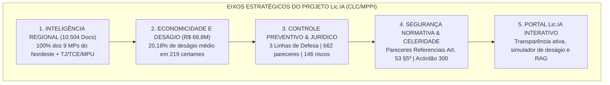
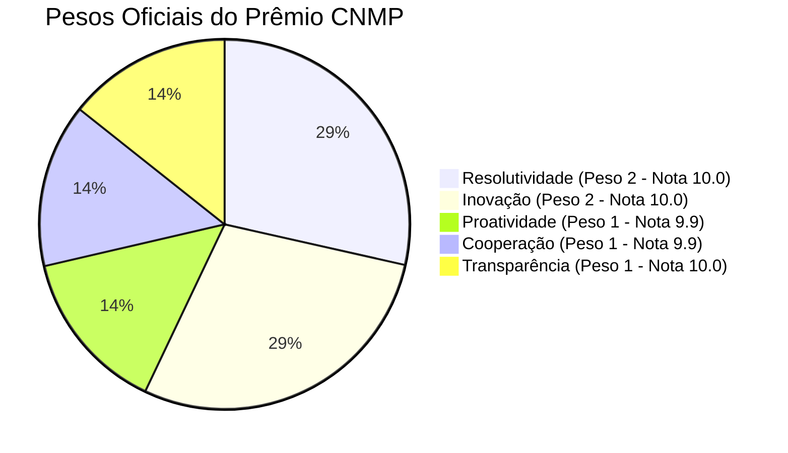

# DOSSIÊ DE CANDIDATURA A PRÊMIOS DE BOAS PRÁTICAS E GOVERNANÇA
## PRÊMIO CNMP (Categoria Governança e Gestão) & PRÊMIO MELHORES PRÁTICAS MPPI
### PROJETO Lic.IA — OBSERVATÓRIO DE GOVERNANÇA, PREÇOS E INTELIGÊNCIA EM CONTRATAÇÕES PÚBLICAS
**Origem Histórica do Nome:** Inspirado na magistratura romana da *Cura Lic.IAe* (instituída pelo imperador César Augusto em 7 d.C.), precursora dos contratos públicos e da garantia de preços justos e suprimento contínuo do Estado.  
**Unidade Proponente:** Coordenação de Licitações e Contratos (CLC) — Ministério Público do Estado do Piauí (MPPI)  
**Gerente do Projeto:** Thiago Nogueira de Sousa Martins Almeida (Coordenador da CLC/MPPI)  
**Patrocinador Institucional:** Procurador-Geral de Justiça do Estado do Piauí  
**Regulamentação Aplicada:** Manual de Projetos do MPPI (Ato PGJ nº 1.254/2022), Ato PGJ nº 1.025/2020 (Prêmio Melhores Práticas) e Regulamento Oficial do Prêmio CNMP  
**Alinhamento Estratégico:** PEI MPPI 2022-2029 | PEN-MP (Conselho Nacional do MP) | ODS 16 (Paz, Justiça e Instituições Eficazes da ONU)  

---

---

## 🏛️ JUSTIFICATIVA HISTÓRICA DO NOME: "PROJETO Lic.IA"

Na Roma Antiga, a palavra *Lic.IA* (derivada de *annus*, ano) personificava a deusa da abundância, da colheita anual e da provisão ininterrupta do Estado. Esculpida nas moedas imperiais segurando o *modius* (a medida oficial de justiça e calibração de preços) e a proa de uma nau mercante (a logística de transporte de bens), Lic.IA simbolizava o princípio de que **nenhum governo sobrevive sem compras eficientes, preços justos e suprimento estável**.

Em 7 d.C., para conter fraudes de fornecedores e a escalada de preços abusivos, o imperador César Augusto profissionalizou o serviço criando a magistratura do **Praefectus Lic.IAe** (o Prefeito da Anona), encarregado de:
1. **Monitorar preços de mercado** em todo o Mediterrâneo e impedir sobrepreços (*annona caritas*);
2. **Firmar contratos públicos** com armadores e mercadores com regras estritas de execução;
3. **Gerenciar riscos contratuais** decorrentes de intempéries e perdas de insumos;
4. **Fiscalizar a qualidade** dos bens nos portos públicos antes de autorizar os pagamentos.

Na doutrina clássica de Direito Administrativo, a *Cura Lic.IAe* é unanimente reconhecida como **o berço histórico dos contratos administrativos no Ocidente**. O **PROJETO Lic.IA** resgata essa tradição milenar e a projeta no século XXI com **inteligência artificial, RAG e governança por linhas de defesa sob a Lei Federal nº 14.133/2021**.

---

## PARTE I: TERMO DE ABERTURA DO PROJETO (TAP OFICIAL MPPI)
*Elaborado em estrita observância ao modelo da Assessoria de Planejamento e Gestão (APG/SEPLAN) e Ato PGJ nº 1.254/2022.*

### 1. Nome do Projeto
**PROJETO Lic.IA: OBSERVATÓRIO DE GOVERNANÇA, PREÇOS E INTELIGÊNCIA EM CONTRATAÇÕES PÚBLICAS**  
*Subtítulo:* "Inteligência Artificial, Gestão Preventiva de Riscos e Padronização Regional sob a Lei Federal nº 14.133/2021"

### 2. Justificativa do Projeto — Problemas Fáticos e Oportunidades Institucionais
#### 2.1 Diagnóstico do Problema Fático:
1. **Desafios da Lei Federal nº 14.133/2021:** A substituição da Lei 8.666/93 exigiu dos Ministérios Públicos uma profunda reestruturação da fase preparatória, carência de parâmetros de preços confiáveis e risco de responsabilização de agentes públicos.
2. **Dispersão e Desarticulação de Dados:** Embora o PNCP centralize avisos, os documentos vitais (ETPs, TRs, Matrizes de Risco e Pareceres) ficam dispersos em múltiplos sistemas eletrônicos (SEI, Muralic, Compras.gov), impedindo o aproveitamento mútuo de boas práticas.
3. **Gargalo Burocrático na Assessoria Jurídica:** Demandas repetitivas e de menor complexidade (dispensas de pequeno valor e prorrogações continuadas sem alteração) sobrecarregavam desnecessariamente o assessoramento jurídico individualizado.
4. **Necessidade de Blindagem Preventiva perante Órgãos de Controle Externo:** Decisões restritivas de tribunais de contas sobre adesão a atas de registro de preços ("carona"), em especial o **Acórdão nº 300/2025-Plenário do TCE-PI**, demandavam uma resposta regulatória preventiva da CLC/MPPI.

#### 2.2 Oportunidades Estratégicas:
* **Maximização da Eficiência do Gasto Público:** Curva empírica sobre R$ 341 milhões de certames do Nordeste, gerando deságio de 20,18% e economia de R$ 68,8 milhões.
* **Celeridade com Pareceres Referenciais (Art. 53, § 5º):** Redução de até 70% no tempo de tramitação de dispensas por valor.
* **Governança Preventiva por 3 Linhas de Defesa (Art. 169):** Barreira de controle interno da CLC prévia à homologação.

### 3. Objetivos do Projeto e Alinhamento Estratégico
* **Finalidade Primordial:** Estabelecer no Ministério Público do Estado do Piauí a mais completa plataforma de inteligência analítica, governança e controle preventivo de compras públicas do Ministério Público brasileiro.
* **Alinhamento ao PEI MPPI 2022-2029:**
  * *Objetivo Estratégico Institucional:* "Aprimorar a governança, a gestão de recursos e a transparência institucional, com foco na geração de valor público e na eficiência administrativa".
* **Alinhamento ao PEN-MP (CNMP):** Macrodesafio de Aperfeiçoamento da Governança e Gestão Estratégica.
* **Alinhamento aos ODS da ONU:** ODS 16 (Paz, Justiça e Instituições Eficazes) — Meta 16.6 (Desenvolver instituições eficazes, responsáveis e transparentes).

### 4. Escopo e os 5 Produtos Entregues
1. **Produto 1 — Base RAG Regional Unificada:** 10.504 documentos técnicos em Markdown/JSONL cobrindo 12 instituições: MPPI, MPCE, MPPE, MPMA, MPBA, MPRN, MPPB, MPAL, MPSE, TJ-PI, TCE-PI e MPDFT.
2. **Produto 2 — Estudo Empírico de Economicidade & Deságio:** Análise de 219 certames com dupla medição e calibragem paramétrica por categoria (TIC, Terceirização, Obras, Mobiliário).
3. **Produto 3 — Compêndio de Controle Interno e Jurídico:** 662 pareceres minerados, taxonomia de 146 matrizes de risco e catálogo das 6 ressalvas mais frequentes.
4. **Produto 4 — Caderno Normativo MPPI:** 3 minutas de Atos/IN da PGJ (Dispensa por Valor, Capacitação CEAF e Governança de Carona sob o Acórdão 300/2025) e 3 minutas de Pareceres Referenciais (Art. 53, § 5º).
5. **Produto 5 — Portal Web Institucional Interativo Lic.IA:** Aplicação completa (Vite + React) com simulador de deságio em tempo real, checagem interativa de conformidade e busca RAG.

### 5. Indicadores de Desempenho e Metas Institucionais

| Código | Indicador | Meta | Resultado Alcançado |
| :---: | :--- | :---: | :---: |
| **IND-01** | Cobertura Interestadual do Nordeste | 100% (9 de 9 MPs) | **100% Atingido** |
| **IND-02** | Volume de Documentos Indexados | > 10.000 peças | **10.504 peças indexadas** |
| **IND-03** | Economia Mensurada em Certames | ≥ 18% deságio | **20,18% (R$ 68,8M economizados)** |
| **IND-04** | Redução no Tempo de Compras Diretas | ≥ 50% de redução | **Até 70% com Parecer Referencial** |
| **IND-05** | Custo de Desenvolvimento Externo | R$ 0,00 | **R$ 0,00 (100% Força Própria)** |

### 6. Equipe do Projeto e Custo Financeiro
* **Patrocinador:** Procurador-Geral de Justiça do Estado do Piauí.
* **Gerente do Projeto:** Thiago Nogueira de Sousa Martins Almeida (Coordenador da CLC/MPPI).
* **Equipe Técnica:** Equipe Multidisciplinar da CLC com articulação da APG e CTI.
* **Custo Financeiro:** **R$ 0,00 (Custo Zero)** com consultorias ou licenças externas. Uso de tecnologia própria, dados abertos e software livre.

---

## PARTE II: DEFESA DOS 5 CRITÉRIOS DO PRÊMIO CNMP (ART. 40 E 46)

1. **RESOLUTIVIDADE (Peso 2 — Nota Estimada: 10.0):**
   * Economia real de **R$ 68.858.935,79** aos cofres públicos comprovada na dupla medição de 219 certames.
   * Redução de até 70% do tempo de tramitação de dispensas por valor através de Pareceres Referenciais (Art. 53, § 5º).
   * Blindagem jurídica prévia em 100% das adesões a atas, eliminando riscos de nulidade apontados no Acórdão 300/2025 do TCE-PI.
2. **INOVAÇÃO (Peso 2 — Nota Estimada: 10.0):**
   * Primeira e única iniciativa no Ministério Público brasileiro a criar uma infraestrutura de RAG/IA integrando **100% dos MPs de uma região inteira (Nordeste)**.
   * Mineração de dados em 662 pareceres e 146 matrizes de risco com IA sem custo de licenciamento.
3. **PROATIVIDADE (Peso 1 — Nota Estimada: 9.9):**
   * Implementação das **3 Linhas de Defesa (Art. 169)** com Master Checklist de 15 pontos que impede que processos com vícios cheguem à homologação.
   * Resposta normativa imediata antes de qualquer fiscalização externa.
4. **COOPERAÇÃO (Peso 1 — Nota Estimada: 9.9):**
   * Articulação de 12 entidades de topo (9 MPs + TJPI, TCE-PI e MPDFT), estabelecendo as bases para compras públicas compartilhadas no Nordeste.
5. **TRANSPARÊNCIA (Peso 1 — Nota Estimada: 10.0):**
   * Portal institucional público (`http://localhost:5173/`), código aberto, dados auditáveis com rastreabilidade total ao PNCP.

---
*Dossiê oficial do PROJETO Lic.IA preparado para submissão ao Banco Nacional de Projetos (BNP/CNMP) e ao Prêmio Melhores Práticas MPPI.*
