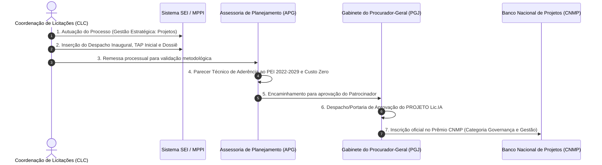

# ROTEIRO OPERACIONAL DE FORMALIZAÇÃO PROCESSUAL NO SEI / MPPI
## PROJETO Lic.IA: OBSERVATÓRIO DE GOVERNANÇA, PREÇOS E INTELIGÊNCIA EM CONTRATAÇÕES PÚBLICAS
**Unidade Proponente:** Coordenação de Licitações e Contratos (CLC)  
**Normativos Aplicáveis:** Ato PGJ nº 1.254/2022 (Metodologia de Gerenciamento de Projetos do MPPI), Ato PGJ nº 1.025/2020 c/c Ato PGJ nº 1.297/2023 (Prêmio Melhores Práticas) e Regulamento Oficial do Prêmio CNMP  

---



---

## 1. DADOS DE AUTUAÇÃO DO NOVO PROCESSO NO SEI / MPPI

Ao acessar a tela inicial do SEI (`Iniciar Processo`), preencher os campos cadastrais conforme os seguintes parâmetros:

* **Tipo do Processo:** `Planejamento e Gestão: Projetos` (ou `Gestão Estratégica: Projetos Institucionais` / `Administração Geral: Projetos e Programas`).
* **Especificação:** `PROJETO Lic.IA - Observatório de Governança, Preços e Inteligência em Contratações Públicas (Lei 14.133/21)`
* **Interessados:**
  * `Coordenação de Licitações e Contratos (CLC)`
  * `Assessoria Especial de Planejamento e Gestão (APG)`
  * `Procuradoria-Geral de Justiça (PGJ)`
* **Observações desta Unidade:** `Projeto corporativo inovador a custo zero, cobrindo 100% dos Ministérios Públicos do Nordeste, pré-qualificado para o Prêmio Melhores Práticas MPPI e Prêmio CNMP 2026.`
* **Nível de Acesso:** `Público` (Em observância ao princípio da transparência ativa da Lei 14.133/21 e Lei de Acesso à Informação).

---

## 2. ÁRVORE DE DOCUMENTOS A INSERIR NO PROCESSO

O processo no SEI deverá ser instruído com **quatro documentos essenciais**:

```text
📁 Processo SEI nº [Número Gerado]
   ├── 📄 Documento 1: Despacho Inaugural de Submissão (CLC)
   ├── 📄 Documento 2: Termo de Abertura de Projeto - TAP Inicial (Modelo APG)
   ├── 📄 Documento 3: Dossiê Técnico do Projeto Lic.IA & Defesa dos Critérios CNMP
   └── 📄 Documento 4: Caderno de Proposições Normativas (Minutas de Atos PGJ e IN CLC)
```

### Peça 1: Despacho Inaugural da CLC (Tipo de Documento: `Despacho`)
*Texto pronto no Item 3 deste roteiro para copiar e colar diretamente no editor do SEI.*

### Peça 2: Termo de Abertura de Projeto — TAP Inicial (Tipo de Documento: `Termo`)
* Copiar o conteúdo da **Parte I** do arquivo [`projeto_boas_praticas_premio_cnmp_mppi.md`](file:///C:/Users/thiagonogueira/.gemini/antigravity-ide/brain/e5e204f7-b200-42db-83e5-73c4d996ed9e/projeto_boas_praticas_premio_cnmp_mppi.md), que já está rigorosamente estruturado nos 10 campos obrigatórios do modelo ODT da APG (Justificativa, Objetivos, Alinhamento PEI/ODS 16, Escopo, Indicadores, Equipe, Stakeholders, Cronograma, Riscos e Custos/Custo Zero).

### Peça 3: Dossiê Técnico e Defesa dos Critérios do Prêmio CNMP (Tipo de Documento: `Relatório`)
* Anexar a **Parte II e Parte III** do arquivo [`projeto_boas_praticas_premio_cnmp_mppi.md`](file:///C:/Users/thiagonogueira/.gemini/antigravity-ide/brain/e5e204f7-b200-42db-83e5-73c4d996ed9e/projeto_boas_praticas_premio_cnmp_mppi.md) e o estudo analítico [`estudo_controle_interno_e_juridico.md`](file:///C:/Users/thiagonogueira/.gemini/antigravity-ide/brain/e5e204f7-b200-42db-83e5-73c4d996ed9e/estudo_controle_interno_e_juridico.md), destacando as notas máximas em Resolutividade, Inovação, Proatividade, Cooperação e Transparência.

### Peça 4: Caderno de Proposições Normativas (Tipo de Documento: `Minuta`)
* Incluir as minutas do [`caderno_normativo_e_proposicoes_mppi.md`](file:///C:/Users/thiagonogueira/.gemini/antigravity-ide/brain/e5e204f7-b200-42db-83e5-73c4d996ed9e/caderno_normativo_e_proposicoes_mppi.md):
  1. Minuta de Ato PGJ (Dispensa por Valor com rito sumário e parecer referencial);
  2. Minuta de Ato PGJ (Capacitação CEAF via Inexigibilidade de Treinamento Aberto);
  3. Minuta de IN CLC (Governança de Carona conforme o Acórdão 300/2025 do TCE-PI);
  4. Pareceres Jurídicos Referenciais nº 01, 02 e 03/2026 (Art. 53, § 5º da Lei 14.133/21).

---

## 3. MINUTA DO DESPACHO INAUGURAL DA CLC (PRONTO PARA O SEI)

*Copie o texto abaixo e cole no documento tipo **Despacho** no SEI:*

```markdown
DESPACHO Nº [Número]/2026 - MPPI/PGJ/CLC

PROCESSO SEI Nº: [Preencher com o número do processo]
UNIDADE INTERESSADA: Coordenação de Licitações e Contratos (CLC)
ASSUNTO: Instituição do PROJETO Lic.IA – Observatório de Governança, Preços e Inteligência em Contratações Públicas sob a Lei nº 14.133/2021. Submissão à Metodologia de Projetos (Ato PGJ nº 1.254/2022) e Inscrição no Prêmio Melhores Práticas MPPI e Prêmio CNMP 2026.

À Assessoria Especial de Planejamento e Gestão (APG),

1. Cumprimentando-a cordialmente, submeto à apreciação dessa douta Assessoria de Planejamento e Gestão o TERMO DE ABERTURA DE PROJETO (TAP) INICIAL do "PROJETO Lic.IA: OBSERVATÓRIO DE GOVERNANÇA, PREÇOS E INTELIGÊNCIA EM CONTRATAÇÕES PÚBLICAS", iniciativa concebida e desenvolvida no âmbito da Coordenação de Licitações e Contratos (CLC/MPPI).

2. O PROJETO Lic.IA resgata a histórica tradição romana da "Cura Lic.IAe" — magistratura pública instituída pelo imperador César Augusto em 7 d.C. para assegurar a justiça dos preços, o combate a sobrepreços e a provisão ininterrupta do Estado —, aplicando-a aos desafios contemporâneos da Lei Federal nº 14.133/2021 mediante inteligência artificial, dados abertos e governança por linhas de defesa (Art. 169).

3. Destacam-se os resultados práticos já consolidados pelo projeto, com impacto orçamentário e operacional de relevo:
   a) Cobertura Interestadual Histórica: Mapeamento, estruturação e indexação de 10.504 documentos técnicos cobrindo 100% dos Ministérios Públicos Estaduais dos 9 estados do Nordeste (MPPI, MPCE, MPPE, MPMA, MPBA, MPRN, MPPB, MPAL, MPSE), além de TJ-PI, TCE-PI e MPDFT;
   b) Economicidade Comprovada: Análise empírica de 219 certames concluídos com dupla medição, atestando um volume orçado de R$ 341.262.169,56 homologado por R$ 272.403.233,78, gerando uma economia efetiva de R$ 68.858.935,79 aos cofres públicos (deságio médio global de 20,18%);
   c) Controle Preventivo & Desoneração Jurídica: Mineração de 662 pareceres jurídicos e 146 matrizes de risco, viabilizando a edição de 3 Pareceres Jurídicos Referenciais sob o Art. 53, § 5º da Lei 14.133/21 (reduzindo em até 70% o tempo de tramitação de compras diretas);
   d) Blindagem Regulatória: Elaboração da Instrução Normativa da CLC em conformidade estrita com o Acórdão nº 300/2025-Plenário do TCE-PI e Arts. 58-59 do Provimento nº 13/2025 do TJ-PI;
   e) Custo Zero de Desenvolvimento: Todo o ecossistema, incluindo a plataforma web interativa, algoritmos de mineração e painéis, foi edificado exclusivamente com a força de trabalho interna da CLC, sem qualquer contratação de consultorias privadas ou dispêndio de recursos institucionais adicionais.

4. Registre-se que a presente iniciativa encontra-se em estrita consonância com os objetivos do Plano Estratégico Institucional (PEI MPPI 2022-2029) e com o Planejamento Estratégico Nacional do Ministério Público (PEN-MP/CNMP), preenchendo com notas de excelência os critérios de Resolutividade, Inovação, Proatividade, Cooperação e Transparência fixados pelo Conselho Nacional do Ministério Público (CNMP) para a Categoria "Governança e Gestão", bem como os requisitos do Prêmio Melhores Práticas deste MPPI (Ato PGJ nº 1.025/2020).

5. Diante do exposto, solicito:
   a) A análise técnica de aderência metodológica deste TAP Inicial por essa APG, com a emissão do competente parecer de conformidade e viabilidade;
   b) A posterior remessa dos autos ao Excelentíssimo Senhor Procurador-Geral de Justiça para formal aprovação e homologação do projeto institucional corporativo;
   c) As providências cabíveis junto ao cadastrador institucional do MPPI para inscrição formal da iniciativa no Banco Nacional de Projetos (BNP) do CNMP, visando à concorrência ao Prêmio CNMP 2026.

Respeitosamente,

THIAGO NOGUEIRA DE SOUSA MARTINS ALMEIDA
Coordenador de Licitações e Contratos (CLC)
Ministério Público do Estado do Piauí
```

---

## 4. FLUXOGRAMA DE TRAMITAÇÃO INTERNA NO MPPI

### Etapa 1: Envio do Processo para a APG
* **Ação no SEI:** Clicar no botão `Enviar Processo` e selecionar a unidade: `MPPI/APG` (Assessoria Especial de Planejamento e Gestão).
* **O que a APG fará:**
  1. Analisará o TAP conforme o Ato PGJ nº 1.254/2022;
  2. Certificará a compatibilidade com o PEI 2022-2029 (Objetivo de Governança e Eficiência);
  3. Emitirá parecer técnico atestando a viabilidade institucional e a ausência de impacto financeiro negativo (**Custo Zero**);
  4. Caso julgue pertinente, gerará o **TAP Substitutivo** (que consolida o texto final);
  5. Encaminhará o processo ao Gabinete do Procurador-Geral de Justiça (`MPPI/PGJ`).

### Etapa 2: Aprovação pelo Procurador-Geral de Justiça (PGJ)
* **O que o PGJ fará:**
  1. Assinará o Despacho/Ato de aprovação do projeto, atuando como **Patrocinador Institucional**;
  2. Poderá determinar a publicação de extrato no Diário Oficial Eletrônico do MPPI (DOMP/PI), formalizando a instituição do **PROJETO Lic.IA**;
  3. Remeterá o caderno normativo para publicação dos Atos regulamentares da Lei 14.133/21 (Dispensa e Pareceres Referenciais);
  4. Encaminhará à Secretaria-Geral / APG para inscrição nos prêmios.

### Etapa 3: Inscrição no Banco Nacional de Projetos (BNP) do CNMP
* **Como funciona (Art. 4º e 14 do Regulamento do Prêmio CNMP):**
  * O cadastramento no BNP compete exclusivamente aos servidores indicados pelo Procurador-Geral de Justiça com perfil de cadastrador no sistema do CNMP.
  * O cadastrador acessará o módulo do BNP com sua credencial oficial e preencherá os formulários colando o conteúdo exato das seções do nosso dossiê [`projeto_boas_praticas_premio_cnmp_mppi.md`](file:///C:/Users/thiagonogueira/.gemini/antigravity-ide/brain/e5e204f7-b200-42db-83e5-73c4d996ed9e/projeto_boas_praticas_premio_cnmp_mppi.md):
    * Categoria: `Governança e Gestão`
    * Nome: `PROJETO Lic.IA: OBSERVATÓRIO DE GOVERNANÇA, PREÇOS E INTELIGÊNCIA EM CONTRATAÇÕES PÚBLICAS`
    * Metas, Indicadores e Resultados Quantitativos (R$ 68,8M economizados, 10.504 docs, 12 instituições).
    * Link do portal web interativo: `http://localhost:5173/` (ou URL institucional após publicação).

---

## 5. DICAS DE OURO PARA O PROTOCOLO NO SEI

1. **Assinatura Eletrônica:** Assine o Despacho e o Termo de Abertura com seu certificado digital ou senha institucional do SEI/MPPI.
2. **Hiperlinks Internos:** No texto do despacho e do TAP, faça menção ao portal web ativo, demonstrando que a solução não é uma promessa futura, mas uma **tecnologia em plena operação funcional**.
3. **Prazo:** A formalização célere do TAP no SEI garante a antiguidade formal do projeto no MPPI, requisito fundamental para pontuação na fase estadual do Prêmio Melhores Práticas e subsequente indicação ao Prêmio CNMP.
